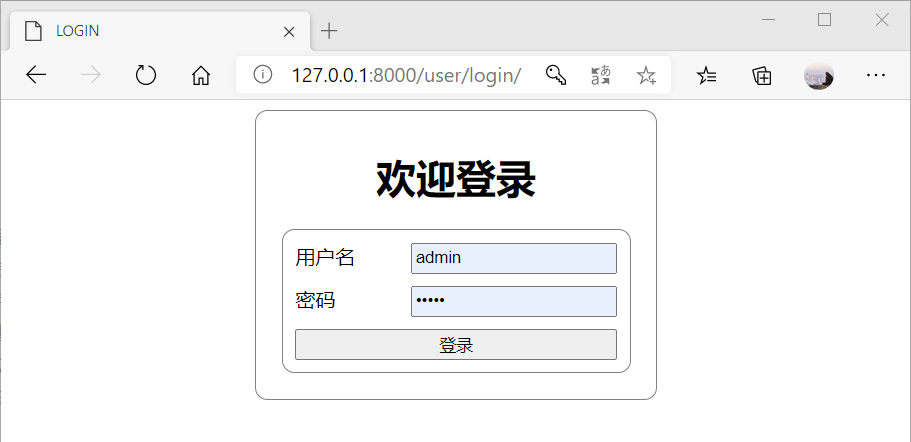
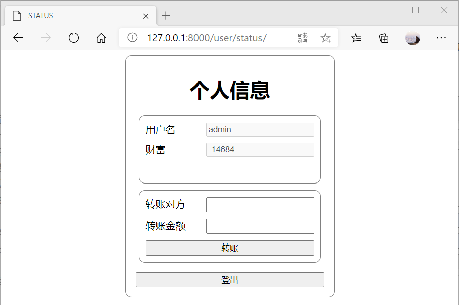

# 项目说明

## 项目介绍

本项目是通过 Django 框架编写的登录小 DEMO。其具有如下的小功能：

-   [x] 注册用户
-   [x] 身份认证
-   [x] 权限认证，限制访问
-   [x] 转账功能

本项目可以用来进行二次开发，同时也可以作为 CSRF 漏洞演练的被攻击网站。

## 项目使用效果图





## 项目架构

```text
.
├── beAttacked                      # 主项目
│   ├── __init__.py
│   ├── asgi.py
│   ├── settings.py                 # 设置
│   ├── urls.py                     # URL
│   └── wsgi.py
├── db.sqlite3                      # 数据库
├── manage.py                       # 管理文件
├── readme.assets                   # Readme文件中的图片资源
├── readme.md                       # Readme
└── user                            # 核心APP
    ├── __init__.py
    ├── admin.py
    ├── apps.py
    ├── models.py                   # 模型
    ├── static                      # 模板CSS
    │   └── user
    │       ├── register.css
    │       ├── register.css.map
    │       └── register.less
    ├── templates                   # 模板
    │   └── user
    │       ├── login.html          # 登录页面
    │       ├── register.html       # 注册页面
    │       └── status.html         # 状态页面
    ├── tests.py                    # 测试
    ├── urls.py                     # URL
    └── views.py                    # 视图处理
```

## 使用方法

前提，运行之前需要满足如下条件：

-   Python >= 3.8
-   Django >= 3.1.0

1. 克隆项目

```bash
git clone git@github.com:KevenGe/Django-login-demo.git
```

2. 运行项目

```python3
python manager.py runserver
```

## 作者

-   Keven Ge

## 版权协议

-   GPL 3.0
